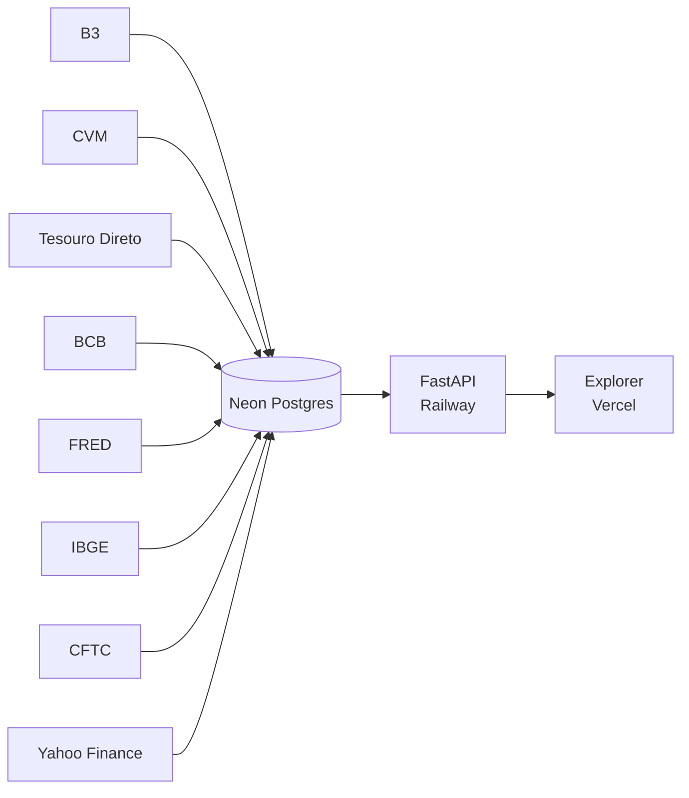

# Open Market Data

> Early development / pre-alpha.

Open-source platform for collecting, normalizing, and publishing financial
market data from public and preferably official sources.

The project aims to provide:

- transparent financial market data
- strong source provenance
- a public API
- reusable public datasets when licensing allows
- an extensible provider architecture

Initial focus is the Brazilian financial market.

## Status

Phases 0–13 of [`docs/IMPLEMENTATION_PLAN.md`](docs/IMPLEMENTATION_PLAN.md)
are implemented in this repository.

- **Phases 0–10:** complete (providers, Parquet for ODbL sources, coverage).
- **Phase 11:** complete for artifacts. Dockerfile, GitHub Actions
  ingest/publish/backfill workflows, and [`docs/DEPLOYMENT.md`](docs/DEPLOYMENT.md)
  exist. Neon (Free) is the serving Postgres. FastAPI is live on Railway at
  [https://api-production-288d4.up.railway.app](https://api-production-288d4.up.railway.app)
  (service `api`, project `open-market-data`).
- **Phase 12:** `marketdata backfill` for CVM, Tesouro, BCB, B3 (optional
  COTAHIST), and Yahoo. Remaining operator work is historical backfill into
  Neon (B3 scratch 2024 slice running). That is not multi-year B3 history.
  Yahoo is currently visible on the public API. B3 and Yahoo are never
  published as Parquet.
- **Phase 13:** Next.js Data Explorer in `apps/explorer`, consuming FastAPI
  `/v1` only (never `DATABASE_URL`). Live at
  [https://open-market-data.vercel.app/](https://open-market-data.vercel.app/)
  with `NEXT_PUBLIC_API_BASE_URL` pointing at the Railway origin (no trailing
  slash). Local default remains `http://127.0.0.1:8000`.

Ingest universe for B3 is GitHub Actions var `INGEST_UNIVERSE=scratch`
(IBOV/SMLL/futures allowlist). CVM persist is Multimercado+Ações. Tesouro
ingest is currently-traded titles only.

See [`docs/ROADMAP.md`](docs/ROADMAP.md).

## Architecture

Ingestion writes immutable raw artifacts to object storage (local filesystem
by default; optional S3-compatible via `uv sync --extra s3`), normalizes into
PostgreSQL, and serves `/v1` from the database only. The Explorer is a
read-only browser app against that API.

Sources persist into Neon Postgres; FastAPI on Railway reads Neon and serves
`/v1`; the Next.js Explorer on Vercel is a read-only client of that API (never
`DATABASE_URL`).



See:

- [`docs/PROJECT_BRIEF.md`](docs/PROJECT_BRIEF.md) — product specification
- [`docs/ARCHITECTURE.md`](docs/ARCHITECTURE.md)
- [`docs/IMPLEMENTATION_PLAN.md`](docs/IMPLEMENTATION_PLAN.md)
- [`docs/DEPLOYMENT.md`](docs/DEPLOYMENT.md) — local run, container, secrets map
- [`docs/INGEST_SCHEDULE.md`](docs/INGEST_SCHEDULE.md) — BRT→UTC cron
- [`docs/LICENSING.md`](docs/LICENSING.md) and [`DATA_LICENSES.md`](DATA_LICENSES.md)

## Quickstart

Python 3.12+ and [uv](https://docs.astral.sh/uv/):

```bash
uv sync
cp .env.example .env
```

Set `DATABASE_URL` to local PostgreSQL. Keep
`CORS_ALLOWED_ORIGINS=http://localhost:3000` for the Explorer. Object storage
defaults to `./data`; no AWS credentials are required.

```bash
docker compose up -d postgres
uv run alembic upgrade head
uv run uvicorn marketdata.api.main:app --reload --host 127.0.0.1 --port 8000
```

Health check (once the API is running):

```bash
curl http://127.0.0.1:8000/v1/health
```

Daily ingest (one reference date; CVM: a monthly ZIP window):

```bash
uv run marketdata ingest all --date 2026-08-24
```

Historical backfill is a different command. Prefer cheap sources first; start
CVM with 2025, not every HIST year. See the operator playbook in
[`docs/DEPLOYMENT.md`](docs/DEPLOYMENT.md) and
[`CONTRIBUTING.md`](CONTRIBUTING.md).

Optional S3-compatible object storage (Cloudflare R2 later):

```bash
uv sync --extra s3
```

Then set `OBJECT_STORAGE_BACKEND=s3` and the `OBJECT_STORAGE_*` variables.
Do not create buckets from this repository.

Coverage (after quotes are ingested):

```bash
uv run marketdata coverage --date 2026-08-24
curl "http://127.0.0.1:8000/v1/coverage?date=2026-08-24&universe=scratch"
```

Coverage scores a CSV universe against stored quotes. It does not fetch
providers. See [`docs/COVERAGE.md`](docs/COVERAGE.md).

### Data Explorer

Requires the API on `http://127.0.0.1:8000` and CORS as above. Never put
`DATABASE_URL` in Next.js.

```bash
cd apps/explorer
npm install
npm run dev
```

Open [http://localhost:3000](http://localhost:3000). Yahoo quotes appear on
`/v1` when the source flag is on. There is no B3 Parquet download.

## License

Source code: Apache License 2.0. Market data remains under each source's terms.
