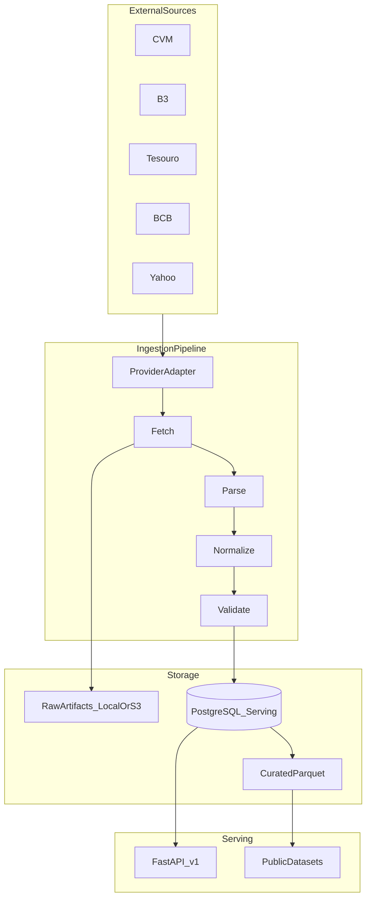

# Architecture

This document describes the system architecture for Open Market Data.

It is architectural guidance for contributors and agents. Product intent lives in
[`PROJECT_BRIEF.md`](PROJECT_BRIEF.md). Binding implementation sequencing lives in
[`IMPLEMENTATION_PLAN.md`](IMPLEMENTATION_PLAN.md).

Code, class names, and public APIs are English. Documentation is English.

---

## Goals

- Collect daily / EOD financial market data from public and preferably official sources.
- Preserve original raw artifacts and full provenance.
- Normalize heterogeneous datasets into a shared domain model without silently converting price semantics.
- Serve small queries through a versioned public FastAPI API.
- Publish bulk Parquet datasets only when redistribution is allowed.
- Remain self-hostable: local PostgreSQL and local filesystem object storage must work.
- Keep the official deployment cloud-neutral: Neon, Railway, and Cloudflare R2 are deployment choices, not domain dependencies.

## Non-goals (MVP Phases 0–11)

The following stay out of the core provider/deploy track:

- Next.js Data Explorer (**Phase 13**, after historical backfill)
- Historical `marketdata backfill` CLI, CVM `HIST/`, COTAHIST (**Phase 12**)
- DuckDB-Wasm
- MCP server
- SDKs
- Corporate actions
- Real-time / streaming / WebSocket data
- Authentication, API keys, billing
- ClickHouse, Airflow, Kafka, Kubernetes, Celery, Redis
- Direct public PostgreSQL access
- Custodian price feeds

The first product is daily EOD market data, not a trading terminal.
Phases 12–13 add stored history and a read-only Explorer on `/v1`.

---

## Logical architecture

```text
                  GitHub Public Repository
                           │
                    GitHub Actions (later)
                           │
                    Python Ingestion
                           │
          ┌────────────────┴────────────────┐
          │                                 │
          ▼                                 ▼
 Object storage                      PostgreSQL
 RAW + curated Parquet               Serving database
 (local filesystem first;            (local first; Neon later)
  S3/R2 later)
          │                                 │
          │                                 ▼
          │                              FastAPI /v1
          │                              (Railway later)
          └────────────────┬────────────────┘
                           │
                      CDN / WAF later
                           │
             ┌─────────────┴─────────────┐
             ▼                           ▼
           Public API              Public datasets
```

A future Next.js Data Explorer (**Phase 13**) must consume the public FastAPI
API. It must not query PostgreSQL directly. It is only useful after **Phase 12**
has backfilled multi-date quotes and series.



---

## Storage layers

There are three conceptual layers:

### RAW

The file exactly as received from the source: CSV, ZIP, XML, JSON, TXT.

No transformation. Raw artifacts are immutable. Identical bytes (`sha256`) should
reuse the same storage object rather than duplicating content.

### CURATED

Normalized analytical datasets, preferably Parquet, generated from serving data
or from a validated normalized representation. These are publication artifacts,
not the system of record for the API.

### SERVING

PostgreSQL holds the data required for the public API: instruments, identifiers,
quotes, series observations, provenance metadata, ingestion runs, and quality events.

Large files never live in PostgreSQL.

---

## Component boundaries

Suggested package layout (adapt only if a simpler layout is clearly better):

```text
src/marketdata/
  domain/          Canonical models, enums, errors. No provider libraries.
  providers/       Source adapters. May depend on mercados, python-bcb, pyield, yfinance.
  ingestion/       Pipeline, downloader, runs, raw-store orchestration.
  normalization/   Shared mapping helpers that still do not import provider libs.
  quality/         Validation and quality events.
  storage/         Database session, repositories, object-store implementations.
  datasets/        Parquet + manifest publisher (later).
  coverage/        Universe coverage engine (CSV vs stored quotes).
  api/             FastAPI app, routes, response schemas.
  cli/             Typer CLI.
```

Rules:

- Domain code must not import `mercados`, `python-bcb`, `pyield`, or `yfinance`.
- API handlers read PostgreSQL only. They never call a provider during a public request.
- Object storage is behind a small interface. Domain and ingestion depend on the interface, not on R2.
- Daily ingest (`marketdata ingest … --date`) and historical backfill
  (`marketdata backfill … --start --end`, Phase 12) are different commands.
  Backfill must checkpoint, rate-limit, and use source-specific history files
  (CVM `HIST/` yearly ZIPs, Tesouro full CSV, BCB 10-year chunks, optional
  B3 COTAHIST).

---

## Observation domains

Do not collapse every datapoint into a generic quote.

| Domain | Examples | Persistence |
|---|---|---|
| Instrument quotes | PETR4 last trade, DI official settlement, fund NAV, Tesouro PU | `instrument_quotes` |
| Market series observations | CDI, Selic, PTAX, IPCA | `market_series_observations` |
| Curve points | DI curve / ETTJ points | `curve_points` (deferred) |

See [`DATA_MODEL.md`](DATA_MODEL.md) and [`PRICE_SEMANTICS.md`](PRICE_SEMANTICS.md).

---

## Provider architecture

Each external source is isolated behind a provider:

```text
fetch → parse → normalize → validate → persist → (later) publish
```

Conceptual contract:

```python
class MarketDataProvider(Protocol):
    name: str

    async def fetch(...) -> RawArtifact: ...
    def parse(...) -> Iterable[RawRecord]: ...
    def normalize(...) -> Iterable[DomainRecord]: ...
```

Providers are registered in a registry. Adding a provider must not require a
large `if/elif` chain.

A provider may be:

- enabled for ingestion
- disabled for public API
- disabled for public dataset publication

Those flags are data, not comments. Publication code must check them.

---

## Object storage

Cloudflare R2 is the intended production object storage, but R2 is not enabled yet.

Initial implementation: `LocalFileObjectStorage` writing under `LOCAL_STORAGE_PATH`
(default `./data`).

Future implementation: `S3ObjectStorage` for any S3-compatible backend, including R2.

Suggested object key layout (not frozen if a better partition scheme appears):

```text
raw/{source}/year=YYYY/month=MM/day=DD/{filename}
curated/{dataset}/source={source}/year=YYYY/month=MM/
public/datasets/...
public/manifests/...
```

---

## Public API

- Versioned from day one: `/v1/`
- FastAPI, OpenAPI at `/docs`, `/redoc`, `/openapi.json`
- No live HTTP to market-data sources during a query
- Responses include provenance: source, official, reference_date, retrieved_at, price_type
- Monetary values serialized as strings/decimals, not binary floats
- Identifier resolution must accept ticker, ISIN, CNPJ, and source-specific IDs
- Pagination with default and maximum limits
- No arbitrary SQL endpoint

Small queries go to the API. Large historical extracts go to Parquet.

---

## Local development versus official deployment

| Concern | Local / self-host | Official instance (later) |
|---|---|---|
| Database | PostgreSQL via `DATABASE_URL` | Neon PostgreSQL via `DATABASE_URL` |
| Object storage | Filesystem | S3-compatible (R2 preferred) |
| API process | `uvicorn` | Railway running the same app |
| Daily ingestion | `marketdata ingest … --date` | GitHub Actions (Phase 11) calling the CLI |
| Historical backfill | `marketdata backfill` (Phase 12) | Same CLI; `DATABASE_URL` may be a Neon branch |
| Data Explorer | `next dev` → local `/v1` (Phase 13) | Vercel → public FastAPI only |
| Docs site | MkDocs locally (later) | GitHub Pages (later) |

The application must not import Neon, Railway, or Cloudflare SDKs in domain code.

---

## Security

- Never commit secrets. Use `.env` locally and platform secrets in production.
- Never expose PostgreSQL to anonymous users.
- Never log `DATABASE_URL` or object-storage credentials.
- Public API is initially anonymous; edge rate limiting comes later.
- Redistribution policy is enforced in code before public API or dataset publication.

---

## Related documents

- [`DATA_MODEL.md`](DATA_MODEL.md)
- [`DATA_SOURCES.md`](DATA_SOURCES.md)
- [`PRICE_SEMANTICS.md`](PRICE_SEMANTICS.md)
- [`LICENSING.md`](LICENSING.md)
- [`ROADMAP.md`](ROADMAP.md)
- [`IMPLEMENTATION_PLAN.md`](IMPLEMENTATION_PLAN.md)
- [`adr/`](adr/)
