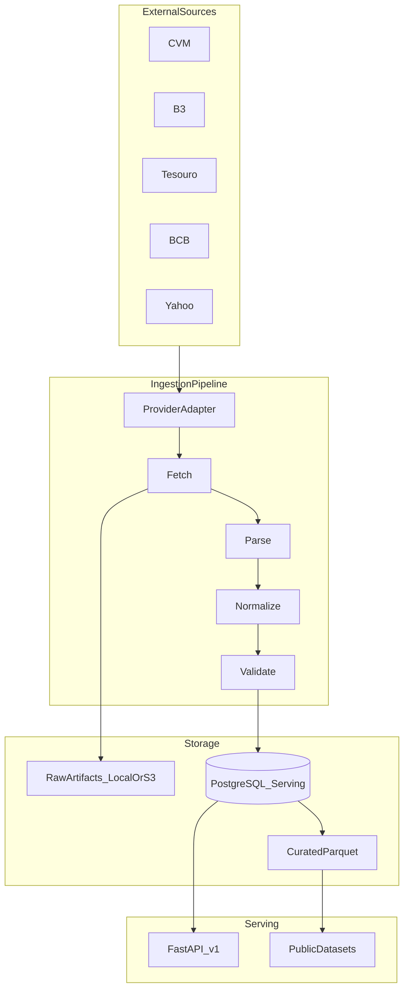

# Architecture

This document describes the system architecture for Open Market Data.

It is architectural guidance for contributors and agents. Product intent lives in
[`PROJECT_BRIEF.md`](PROJECT_BRIEF.md). Binding implementation sequencing lives in
[`IMPLEMENTATION_PLAN.md`](IMPLEMENTATION_PLAN.md).

Code, class names, and public APIs are English. Documentation is English.

---

## Goals

- Collect daily / EOD financial market data from public and preferably official sources.
- Preserve original raw artifacts and full provenance.
- Normalize heterogeneous datasets into a shared domain model without silently converting price semantics.
- Serve small queries through a versioned public FastAPI API.
- Publish bulk Parquet datasets only when redistribution is allowed.
- Remain self-hostable: local PostgreSQL and local filesystem object storage must work.
- Keep the official deployment cloud-neutral: Neon, Railway, and Cloudflare R2 are deployment choices, not domain dependencies.

## Non-goals (still out of MVP)

Phases 11–13 are implemented in-repo: deploy **artifacts** (not provisioned
cloud projects), `marketdata backfill`, and a local Next.js Explorer on `/v1`.

The following stay out of MVP:

- DuckDB-Wasm
- MCP server
- SDKs
- Corporate actions
- Real-time / streaming / WebSocket data
- Authentication, API keys, billing
- ClickHouse, Airflow, Kafka, Kubernetes, Celery, Redis
- Direct public PostgreSQL access
- Custodian price feeds
- Creating Neon, Railway, R2, or Vercel projects from this repository

The first product is daily EOD market data plus stored history and a read-only
Explorer, not a trading terminal.

---

## Logical architecture

```text
                  GitHub Public Repository
                           │
              GitHub Actions (CI + ingest + backfill dispatch)
                           │
                    Python Ingestion
                           │
          ┌────────────────┴────────────────┐
          │                                 │
          ▼                                 ▼
 Object storage                      PostgreSQL
 RAW + curated Parquet               Serving database
 (local filesystem default;          (local first; Neon is a
  optional S3/R2 extra)               later operator choice)
          │                                 │
          │                                 ▼
          │                              FastAPI /v1
          │                              CORS from CORS_ALLOWED_ORIGINS
          └────────────────┬────────────────┘
                           │
             ┌─────────────┴─────────────┐
             ▼                           ▼
      Public API + Explorer         Public datasets
      (Next.js → /v1 only;          (ODbL Parquet; no B3)
       never DATABASE_URL)
```

The Data Explorer (`apps/explorer`) consumes FastAPI `/v1` only. It must not
query PostgreSQL. Yahoo quotes may appear on `/v1` while `public_api_enabled`
is true; they are never published as Parquet. B3 quotes may appear on `/v1`
(`API_ONLY`) but are never published as Parquet.



---

## Storage layers

There are three conceptual layers:

### RAW

The file exactly as received from the source: CSV, ZIP, XML, JSON, TXT.

No transformation. Raw artifacts are immutable. Identical bytes (`sha256`) should
reuse the same storage object rather than duplicating content.

### CURATED

Normalized analytical datasets, preferably Parquet, generated from serving data
or from a validated normalized representation. These are publication artifacts,
not the system of record for the API.

### SERVING

PostgreSQL holds the data required for the public API: instruments, identifiers,
quotes, series observations, provenance metadata, ingestion runs, and quality events.

Large files never live in PostgreSQL.

---

## Component boundaries

Suggested package layout (adapt only if a simpler layout is clearly better):

```text
src/marketdata/
  domain/          Canonical models, enums, errors. No provider libraries.
  providers/       Source adapters. May depend on mercados, python-bcb, pyield, yfinance.
  ingestion/       Pipeline, downloader, runs, raw-store orchestration.
  normalization/   Shared mapping helpers that still do not import provider libs.
  quality/         Validation and quality events.
  storage/         Database session, repositories, object-store implementations.
  datasets/        Parquet + manifest publisher (Phase 9).
  coverage/        Universe coverage engine (CSV vs stored quotes).
  api/             FastAPI app, routes, response schemas.
  cli/             Typer CLI.
```

Rules:

- Domain code must not import `mercados`, `python-bcb`, `pyield`, or `yfinance`.
- API handlers read PostgreSQL, except `GET /v1/datasets` which reads
  **object-storage manifests** (never providers, never live market HTTP).
- Object storage is behind a small interface. Domain, ingestion, and dataset
  publication depend on the interface, not on R2.
- Daily ingest (`marketdata ingest … --date`) and historical backfill
  (`marketdata backfill … --start --end`) are different commands.
  Backfill checkpoints, rate-limits, and uses source-specific history files
  (CVM `HIST/` yearly ZIPs, Tesouro full CSV, BCB 10-year chunks, optional
  B3 COTAHIST). `backfill.yml` is `workflow_dispatch` only.

---

## Observation domains

Do not collapse every datapoint into a generic quote.

| Domain | Examples | Persistence |
|---|---|---|
| Instrument quotes | PETR4 last trade, DI official settlement, fund NAV, Tesouro PU | `instrument_quotes` |
| Market series observations | CDI, Selic, PTAX, IPCA | `market_series_observations` |
| Curve points | DI curve / ETTJ points | `curve_points` (deferred) |

See [`DATA_MODEL.md`](DATA_MODEL.md) and [`PRICE_SEMANTICS.md`](PRICE_SEMANTICS.md).

---

## Provider architecture

Each external source is isolated behind a provider:

```text
fetch → parse → normalize → validate → persist → (later) publish
```

Conceptual contract:

```python
class MarketDataProvider(Protocol):
    name: str

    async def fetch(...) -> RawArtifact: ...
    def parse(...) -> Iterable[RawRecord]: ...
    def normalize(...) -> Iterable[DomainRecord]: ...
```

Providers are registered in a registry. Adding a provider must not require a
large `if/elif` chain.

A provider may be:

- enabled for ingestion
- disabled for public API
- disabled for public dataset publication

Those flags are data, not comments. Publication code must check them.

---

## Object storage

Cloudflare R2 is the intended production object storage, but R2 is not enabled
and this repository does not create buckets.

Default: `LocalFileObjectStorage` writing under `LOCAL_STORAGE_PATH`
(default `./data`). No AWS credentials are required.

Optional: `S3ObjectStorage` (`OBJECT_STORAGE_BACKEND=s3`) after
`uv sync --extra s3`. Domain and ingestion code depend on the storage
interface, not on boto3.

Suggested object key layout (not frozen if a better partition scheme appears):

```text
raw/{source}/year=YYYY/month=MM/day=DD/{filename}
public/datasets/{name}/schema_v1/{YYYY-MM-DD}.parquet
public/manifests/{name}/{YYYY-MM-DD}.json
public/manifests/{name}-latest.json
```

Hive partitions (`source=/year=/month=`) and a parallel `curated/` tree are
deferred. Phase 9 writes one Parquet file per catalog name per snapshot under
`public/datasets/`. R2 is not required; local filesystem is the development
backend. See [`DATASETS.md`](DATASETS.md).

---

## Public API

- Versioned from day one: `/v1/`
- FastAPI, OpenAPI at `/docs`, `/redoc`, `/openapi.json`
- CORS when `CORS_ALLOWED_ORIGINS` is non-empty (`allow_methods=["GET"]`)
- No live HTTP to market-data sources during a query
- Responses include provenance: source, official, reference_date, retrieved_at, price_type
- Monetary values serialized as strings/decimals, not binary floats
- Identifier resolution must accept ticker, ISIN, CNPJ, and source-specific IDs
- Pagination: default `limit` 500, max 5000; optional `start` / `end` / `cursor`
- Instrument search: `GET /v1/instruments?q=` (public-API-visible only)
- No arbitrary SQL endpoint. Yahoo remains 404 on public quotes.

Small queries go to the API. Large historical extracts go to Parquet
(`marketdata publish datasets`; listing at `GET /v1/datasets`).

---

## Local development versus official deployment

| Concern | Local / self-host | Official instance (operator, not created here) |
|---|---|---|
| Database | PostgreSQL via `DATABASE_URL` | Neon PostgreSQL via `DATABASE_URL` |
| Object storage | Filesystem (`./data`) | S3-compatible (R2 preferred) after `uv sync --extra s3` |
| API process | `uvicorn` | Railway running the repository `Dockerfile` |
| Daily ingestion | `marketdata ingest … --date` | GitHub Actions calling the CLI |
| Historical backfill | `marketdata backfill --start --end` | Same CLI; `backfill.yml` is dispatch-only |
| Data Explorer | `cd apps/explorer && npm run dev` → `http://127.0.0.1:8000` | Vercel → public FastAPI only (not provisioned) |
| Docs site | MkDocs locally (later) | GitHub Pages (later) |

Phase 11 shipped the Dockerfile and workflows. It did **not** create Neon,
Railway, R2, or Vercel projects. The application must not import those SDKs
in domain code.

---

## Security

- Never commit secrets. Use `.env` locally and platform secrets in production.
- Never expose PostgreSQL to anonymous users.
- Never log `DATABASE_URL` or object-storage credentials.
- Public API is initially anonymous; edge rate limiting comes later.
- Redistribution policy is enforced in code before public API or dataset publication.

---

## Related documents

- [`DATA_MODEL.md`](DATA_MODEL.md)
- [`DATA_SOURCES.md`](DATA_SOURCES.md)
- [`DATASETS.md`](DATASETS.md)
- [`PRICE_SEMANTICS.md`](PRICE_SEMANTICS.md)
- [`LICENSING.md`](LICENSING.md)
- [`DEPLOYMENT.md`](DEPLOYMENT.md)
- [`INGEST_SCHEDULE.md`](INGEST_SCHEDULE.md)
- [`ROADMAP.md`](ROADMAP.md)
- [`IMPLEMENTATION_PLAN.md`](IMPLEMENTATION_PLAN.md)
- [`adr/`](adr/)
