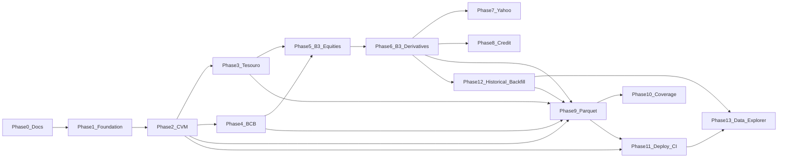

# Implementation Plan

> For agentic workers: implement **one phase per session**. Read `AGENTS.md`,
> this file, and the linked docs before writing code. Do not start the next
> phase unless the user explicitly asks. Do not create cloud resources, git
> branches, pull requests, or worktrees unless the current phase says so.

**Goal:** Build an open-source EOD market-data platform that ingests official
public sources, preserves provenance, serves a versioned FastAPI API, and
publishes Parquet only when licensing allows.

**Architecture:** Provider adapters fetch immutable raw artifacts into object
storage, normalize into PostgreSQL (instrument quotes vs market series vs
later curve points), and serve `/v1` from the database only. Local filesystem
storage and generic `DATABASE_URL` are required; Neon, Railway, and R2 are
later deployment choices.

**Tech stack:** Python 3.12+, uv, Polars, Pydantic, FastAPI, SQLAlchemy 2,
Alembic, PostgreSQL, httpx, tenacity, Typer, pytest, Ruff, Pyright.

## Global constraints

- Never persist financial prices as binary floats.
- Never silently convert price semantics.
- Never import `mercados`, `python-bcb`, `pyield`, or `yfinance` outside `providers/`.
- Never redistribute data unless `redistribution_policy` and capability flags allow it.
- Never commit secrets. Never log `DATABASE_URL`.
- Local development must not require Neon, Railway, or Cloudflare.
- Do not implement Next.js, auth, billing, real-time, MCP, SDKs, ClickHouse,
  Airflow, Kafka, or Kubernetes until the phase that names them (Next.js is
  Phase 13 only).
- English for code, APIs, and these docs.
- Prefer complete vertical slices over partial platform-wide work.

## Planning corrections (do not silently revert)

Validated 2026-08-24 against official sources:

- CVM current files are **monthly ZIPs**, not bare CSVs (CSV URLs return 403).
- CVM identity is currently `CNPJ_FUNDO_CLASSE` + `ID_SUBCLASSE` (since 2023-12),
  with two older header eras.
- CVM daily reprocess window should default near **90 days**, not 7.
- B3 FTP is dead. BVBG.186/187/028.02 are current. 186/187 download prefixes
  still need discovery in Phase 5.
- B3 public redistribution is **default deny** until licensed.
- B3 equity `LastPric` is last trade (`LAST`), not adjusted close.
- B3 derivative settlement is `AdjstdQt` → `OFFICIAL_SETTLEMENT`.
- Tesouro ingestion is the **CKAN CSV**; Data Lake REST returned 404.
- Tesouro identity is `title_type + maturity_date`. PYield `tpf.taxas` is ANBIMA.
- BCB history queries are limited to **10-year** windows.
- CVM, Tesouro, and BCB data are ODbL (`PUBLIC_WITH_ATTRIBUTION`).
- Yahoo code ≠ Yahoo data license; gate public exposure in code.

## Repository starting state (Phase 0 complete)

After Phase 0, the repo has seed documentation, ADRs, `DATA_LICENSES.md`, and
this plan. It still lacks `pyproject.toml`, `src/`, tests, CI, and `LICENSE`.

Do not rewrite `docs/PROJECT_BRIEF.md`. Update other docs only when
implementation makes them wrong.

---

## Phase dependency graph



### Sequential (must not parallelize)

- Phase 0 → Phase 1 → Phase 2
- Phase 5 → Phase 6 (shared B3 adapter)
- Phase 12 → Phase 13 (Explorer needs stored history)

### Safe parallel after Phase 2 (isolated worktrees)

- Phase 3 Tesouro ∥ Phase 4 BCB
- File contract: Tesouro owns `providers/tesouro.py`, Tesouro tests, Tesouro
  docs. BCB owns `providers/bcb.py`, series API routes, BCB tests. Parent
  integrates shared files (`registry.py`, `pipeline.py`, `api/main.py`,
  migrations) **after** both land, or serializes those shared edits in the
  parent checkout.

### Must not run concurrently

- Two agents on the same checkout
- Phase 1 Foundation (too many shared files)
- Phase 5 and Phase 6
- Phase 9 publisher while quote/series schema is still changing
- Phase 11 deploy while migrations are in flux
- Phase 13 Explorer before Phase 12 can serve multi-date `/v1` history

### Worktree rule

- Read-only research: no worktree.
- Independent concurrent writes: isolated worktrees, non-overlapping files.
- Parent agent owns integration and review.
- Do not create worktrees until that phase starts.

---

## Phase 0 — Documentation and planning artifacts

**Objective:** Give later sessions a stable spec.

**Scope:** Seed docs, ADRs, `DATA_LICENSES.md`, this plan. No application code.

**Deliverables:** Non-empty `ARCHITECTURE`, `DATA_MODEL`, `DATA_SOURCES`,
`PRICE_SEMANTICS`, `LICENSING`, `OPEN_SOURCE_REVIEW`, `ROADMAP`; ADR-0001
through ADR-0014; `DATA_LICENSES.md`; `IMPLEMENTATION_PLAN.md`.

**Files:** `docs/*.md`, `docs/adr/*.md`, `DATA_LICENSES.md`

**External / infrastructure dependencies:** None

**Tests:** Markdown consistency review only

**Documentation updates:** This phase is documentation

**Acceptance criteria:** Docs match research corrections; ADRs cover stack and
identity/licensing; recommended Phase 1 prompt exists at the end of this file.

**Depends on:** Nothing

**Risks:** Treating PROJECT_BRIEF as frozen while official sources moved

**Out of scope:** `pyproject.toml`, code, CI, cloud, commits

**Subagents:** Explore/research (done during planning). No implementation
subagents.

**Worktrees:** None

**Status:** Complete when those files exist in the repository.

---

## Phase 1 — Foundation

**Objective:** Runnable Python package with domain models, PostgreSQL schema,
local object storage, provider protocol, CLI/API skeletons, and CI — ready for
CVM without implementing CVM.

**Scope:**

- `pyproject.toml` + `uv.lock`; Python `>=3.12`
- Package under `src/marketdata/`
- Pydantic v2 domain models and enums
- SQLAlchemy 2 models + first Alembic migration for tables in
  [`DATA_MODEL.md`](DATA_MODEL.md) except `curve_points` and
  `dataset_publications` (create stubs only if it keeps migrations simpler;
  prefer omitting unused tables until needed)
- `ObjectStorage` protocol + `LocalFileObjectStorage`
- `MarketDataProvider` protocol + `ProviderRegistry` (no real providers)
- Typer CLI: `marketdata --help`; placeholders must not pretend to ingest
- FastAPI: app factory, `/v1/health`, OpenAPI
- Pydantic Settings from environment / `.env`; preserve `.env.example`
- Recommend changing CVM-oriented `RECENT_REPROCESS_DAYS` default toward 90
  in `.env.example` with a comment that providers may override
- pytest, Ruff, Pyright
- GitHub Actions `ci.yml`
- `LICENSE` (Apache-2.0), `CONTRIBUTING.md` (setup + uv commands), README
  quickstart
- Optional `docker-compose.yml` for PostgreSQL (not required to run unit tests)

**Expected deliverables:**

- `uv sync` works
- `uv run pytest` passes without live market HTTP
- `uv run ruff check .` and `uv run ruff format --check .` pass
- `uv run pyright` passes
- `uv run marketdata --help` works
- FastAPI app imports; `/v1/health` returns OK in a TestClient test
- Alembic migration is reviewable; applying it is documented (use configured
  development DB only when safe)

**Important files / modules:**

```text
pyproject.toml
LICENSE
CONTRIBUTING.md
README.md
.github/workflows/ci.yml
src/marketdata/__init__.py
src/marketdata/config.py
src/marketdata/domain/enums.py
src/marketdata/domain/instrument.py
src/marketdata/domain/quote.py
src/marketdata/domain/series.py
src/marketdata/domain/source.py
src/marketdata/domain/artifact.py
src/marketdata/domain/errors.py
src/marketdata/providers/base.py
src/marketdata/providers/registry.py
src/marketdata/storage/object_store.py
src/marketdata/storage/database.py
src/marketdata/storage/models.py
src/marketdata/storage/repositories.py
src/marketdata/api/main.py
src/marketdata/api/routes/health.py
src/marketdata/cli/main.py
alembic.ini
migrations/
tests/unit/
```

Keep modules small. Do not add a DI framework.

**External dependencies (Phase 1 only):**

fastapi, uvicorn, sqlalchemy, alembic, psycopg[binary], pydantic-settings,
typer, httpx, tenacity, polars, structlog (optional but useful), pytest,
pytest-asyncio, ruff, pyright.

Do **not** add mercados, python-bcb, pyield, yfinance, boto3.

**Infrastructure:** Local PostgreSQL via `DATABASE_URL` when running migrations
or DB tests. Filesystem `./data` (gitignored). No Neon/Railway/R2 resources.

**Tests:**

- Settings load defaults without production secrets
- Local object store round-trip in a tmp path
- Domain models reject float-like persistence helpers if you expose them;
  Decimal values accepted
- Registry registers and retrieves a fake provider
- Health endpoint
- Redistribution flags exist on Source model
- Unit tests never hit CVM/B3/Tesouro/Yahoo
- DB tests: mark `pytest.mark.db` and skip if `DATABASE_URL` missing, unless
  you use a dedicated testcontainer (optional, do not require Docker)

**Documentation updates:** README quickstart; note Pyright in CONTRIBUTING;
do not invent Phase 2 provider docs yet.

**Acceptance criteria / definition of done:**

- Quality commands above pass
- No secrets in the tree
- `.gitignore` still ignores `.env` and `data/`
- Provider isolation is structurally possible (empty providers package)
- No CVM/B3 ingestion code

**Depends on:** Phase 0

**Known risks:** Over-engineering the pipeline before a real provider exists.
Keep fetch/parse/normalize as protocol methods, not a mini-Airflow.

**Out of scope:** Real providers, Parquet publisher, coverage, Docker-required
workflow, cloud provisioning, commits/PRs unless the user asks.

**Subagents:**

| Task | Class |
|---|---|
| Confirm SQLAlchemy 2 + Alembic src-layout pattern | Explore / research |
| Object-storage unit tests | Testing |
| Boundary review: no premature provider libs | Review |
| Optional split of storage vs API after protocols exist | Implementation |

**Worktrees:** Default **single checkout**. Optional storage vs API/CLI
worktrees only if the parent froze protocols first and files do not overlap.

**Cursor mode:** Agent Mode. Re-enter Plan Mode only if the schema in
`DATA_MODEL.md` proves unworkable.

---

## Phase 2 — CVM Fund NAV (first vertical)

**Objective:** End-to-end CVM Informe Diário → `FUND_NAV` → PostgreSQL → FastAPI.

**Scope:**

- Spike: can `mercados` fetch current monthly ZIPs? If yes, wrap it. If no,
  `httpx` GET
  `https://dados.cvm.gov.br/dados/FI/DOC/INF_DIARIO/DADOS/inf_diario_fi_{YYYY}{MM}.zip`
- Store raw ZIP in object storage; `raw_artifacts` + `ingestion_runs`
- Header-driven parser for schema eras A/B/C (see `DATA_SOURCES.md`)
- Latin-1, semicolon, Decimal `VL_QUOTA`
- Upsert instruments + `CNPJ_FUNDO_CLASSE` / `CNPJ_FUNDO` / optional subclass
- Quality: non-null quota, parseable date, positive quota, duplicate detection
- Idempotent upsert; new SHA → new revision, keep old artifact
- Reprocess window: months covering `recent_reprocess_days` (default 90)
- CLI: `marketdata ingest cvm --date YYYY-MM-DD`
- CLI: `marketdata explain <cnpj-or-id> --date YYYY-MM-DD`
- API: `GET /v1/health` (existing), `GET /v1/sources`,
  `GET /v1/funds/{identifier}/quotes`,
  `GET /v1/funds/{identifier}/quotes/latest`
- `InstrumentResolver` for punctuated and digits-only CNPJ
- Source row: official, ODbL, `PUBLIC_WITH_ATTRIBUTION`, all three capability
  flags true
- NOTICE/LGPL text if mercados is added

**Deliverables:** Real NAV for a known CNPJ via API; explain shows artifact
sha256; second ingest does not duplicate identical bytes.

**Files:** `providers/cvm.py`, `ingestion/pipeline.py`, repositories, fund
routes, `docs/providers/cvm.md`, fixtures under `tests/fixtures/cvm/`
(synthetic era A/B/C headers; tiny synthetic rows — prefer not to commit huge
real ZIPs)

**External dependencies:** httpx (already); mercados only if the spike passes

**Infrastructure:** Local only

**Tests:** Era parsers; empty subclass; idempotency; API with test DB;
`@pytest.mark.integration` live ZIP optional and **not** required on every CI
commit

**Documentation:** `docs/providers/cvm.md`; update `DATA_LICENSES.md` if needed

**Acceptance criteria:**

1. At least one monthly ZIP fetched (integration or documented manual smoke)
2. Normalized rows in PostgreSQL
3. `GET /v1/funds/{cnpj}/quotes` returns a real `VL_QUOTA` as decimal string
   with `price_type=FUND_NAV`
4. Idempotent re-ingest; different SHA creates revision
5. `marketdata explain` traces to raw artifact
6. CI unit/contract tests green

**Depends on:** Phase 1

**Risks:** mercados pre-1.0; cadastral class vs fund CNPJ mismatch; CVM
throttling. Mitigate: quotes-first, cadastral later; polite concurrency.

**Out of scope:** Full cadastral sync, Parquet, GitHub ingest workflow,
Tesouro/B3, CVM `HIST/` yearly archive (Phase 12)

**Subagents:**

| Task | Class |
|---|---|
| Spike mercados ZIP vs httpx | Explore / research |
| Era A/B/C fixture tests | Testing |
| Decimal + semantics review | Review |

**Worktrees:** **Not recommended** (pipeline + schema shared).

**Cursor mode:** Agent Mode after Phase 1 is merged/complete.

---

## Phase 3 — Tesouro Direto

**Objective:** Official Tesouro Direto retail quotes from the CKAN CSV.

**Scope:**

- `TesouroProvider` downloads the official CSV (follow CKAN `package_show` or
  the documented resource URL; handle redirects)
- Preserve raw CSV bytes
- Parse `;`, decimal comma, `DD/MM/YYYY`
- Map marketing names → `title_type` (table in `DATA_SOURCES.md`)
- Identity: `title_type + maturity_date` (+ conversion_year if present)
- Multiple quotes per day: `PU_BASE`, `BID_PU`, `ASK_PU`, `YIELD` (compra/venda)
- Resolver support for composite identifiers
- API via existing quotes routes (`GET /v1/quotes/{identifier}/latest` as
  needed)
- Source: ODbL, public flags on
- Do not call Tesouro Data Lake REST until it is re-validated
- Do not use PYield as the price source; optional adapter-internal PU checks only

**Deliverables:** PU_BASE for a known title/maturity in PostgreSQL and API

**Files:** `providers/tesouro.py`, mapping table, `docs/providers/tesouro.md`,
`tests/fixtures/tesouro/`

**External dependencies:** httpx; pyield optional and adapter-only

**Infrastructure:** Local only

**Tests:** Locale parsing; title mapping; four price types; idempotency

**Documentation:** Provider doc; DATA_LICENSES already lists Tesouro

**Acceptance criteria:** Real CSV parse; quotes queryable; provenance linked;
CI green

**Depends on:** Phase 2 (shared pipeline)

**Parallel with:** Phase 4 (worktree; avoid overlapping `pipeline.py` unless
parent serializes)

**Risks:** Header drift; NTN-B1 identity; confusing ANBIMA with Tesouro

**Out of scope:** REST Data Lake, ANBIMA, curve stripping, unfiltered
full-CSV history load (Phase 12 `backfill tesouro`)

**Subagents:** Explore current CKAN resource URL; Testing parsers; Review
price types

**Worktrees:** Yes, if Phase 4 is concurrent and files are disjoint

---

## Phase 4 — BCB (PTAX, Selic, CDI)

**Objective:** Market series observations, not instrument quotes.

**Scope:**

- `BcbProvider` using `python-bcb` behind the adapter
- Series: SGS 11, 12, 432, 1, 10813
- Chunk requests to ≤10 years
- Persist raw JSON artifacts when practical
- Convert pandas → Decimal + Polars at adapter boundary
- Explicit units (`percent_per_day` vs `percent_per_year` vs FX)
- API: `GET /v1/series/{code}/observations` and latest
- Source: ODbL, public flags on

**Deliverables:** CDI/Selic/PTAX queryable as series

**Files:** `providers/bcb.py`, series routes, `docs/providers/bcb.md`

**External dependencies:** python-bcb (MIT)

**Infrastructure:** Local only

**Tests:** Chunking; unit metadata; do not insert into `instrument_quotes`

**Acceptance criteria:** Real SGS values in DB + API; CI green

**Depends on:** Phase 2

**Parallel with:** Phase 3

**Risks:** Rate limits; unit confusion; pandas leakage into domain

**Out of scope:** Expectativas, full SGS catalog, IPCA (later), multi-year
range ingest CLI (Phase 12 `backfill bcb`; keep the 10-year chunk helper)

**Subagents:** Explore python-bcb APIs; Testing unit conversions; Review domain
boundary

**Worktrees:** Yes, with Phase 3 if files disjoint

---

## Phase 5 — B3 equities

**Objective:** EOD last-trade prices for equities, BDRs, ETFs, FIIs, options
from BVBG.186 + instrument master BVBG.028.02.

**Scope:**

- Discover 186 download method (prefix vs portal contentId)
- Parse XML-in-nested-ZIP
- `LastPric` → `LAST`; never Adj Close
- Sync identifiers from 028.02
- Source flags: ingest on, **public API/datasets off** on official instance
- COTAHIST deferred to Phase 12 (different semantics; not a substitute for 186)
- Validate ZIP size (B3 may 200-empty)

**Deliverables:** Local API or DB query for PETR4 history from B3 while public
gate remains off (or local-only API)

**Depends on:** Phase 2 at minimum; prefer 3–4 done so resolver is mature

**Risks:** Prefix opacity; license; 186 vs 086 divergence

**Out of scope:** Public Parquet of B3; derivatives settlement; corporate
actions; COTAHIST / multi-year B3 backfill (Phase 12)

**Subagents:** Explore BVBG samples (research); Review redistribution flags

**Worktrees:** Not in parallel with Phase 6

**Phase-blocking question:** 186/187 download codes

**Blocking for publication:** B3 license (ADR-0014)

---

## Phase 6 — B3 derivatives

**Objective:** DI1/DOL/WIN/IND official settlement from BVBG.187.

**Scope:** `AdjstdQt` / `AdjstdQtTax` → `OFFICIAL_SETTLEMENT`; never map
`LastPric` to settlement; optional OI/volume metadata.

**Deliverables:** DI1 settlement quotes with correct `price_type`

**Depends on:** Phase 5

**Out of scope:** Recomputing settlement from curves; multi-year BVBG.187
backfill (Phase 12)

**Worktrees:** None concurrent with Phase 5

**Status:** Complete

---

## Phase 7 — Yahoo (local / POC)

**Objective:** Global EOD for coverage experiments.

**Scope:** yfinance adapter; Close not Adj Close; `is_official=false`;
public flags false; tests that public routes omit Yahoo.

**Depends on:** Prefer after Phase 6; may wait so it does not distract

**Out of scope:** Public redistribution

**Status:** Complete

---

## Phase 8 — Brazilian credit

**Objective:** Persist last-trade quotes for B3-published debênture / CRI / CRA
prints, and record `NO_PUBLIC_PRICE` absence when the OTC trades file was
published but an instrument in the cadastro has no usable Último Preço.

**Status:** Complete

**Scope:**

- Extend `marketdata ingest b3 --date` (no new provider or `/v1/credit`)
- Boletim Diário POST export: `ConsolidatedRecords` + `InstrumentRegistration`
- `Closing` / Último Preço → `PriceType.LAST` via `exact_decimal`; unit `BRL`
- Filter DEB / CRI / CRA (including CRI/CRA PÚBLICO); ignore CDB and RF ETFs
- Collapse INTRAGRUPO/EXTRAGRUPO groupings to one LAST per instrument + date
- Upsert CREDIT instruments from cadastro; quality_event absence, not a quote
- Keep source `b3` flags: `API_ONLY`, public API on, Parquet off
- Serve through existing `GET /v1/quotes` and `api/access.py`

**Depends on:** Phases 5–6

**Out of scope:** Fair-value models, ANBIMA, CALC, UP2DATA Debêntures MTM,
BVBG.186 for credit, RF bulletin `PU_MERCADO` as LAST, `/v1/coverage`
(Phase 10)

---

## Phase 9 — Public Parquet datasets

**Objective:** Curated Parquet + manifests for ODbL sources only.

**Scope:** Publisher checks `redistribution_policy` and
`public_dataset_enabled`; atomic latest manifest; skip B3/Yahoo.

**Depends on:** Phases 2–4 data; B3 only if ADR-0014 changes. Full-history
Parquet is more useful after Phase 12, but a partial serving snapshot may be
published earlier.

**Out of scope:** Public B3/Yahoo files; implementing `marketdata backfill`

---

## Phase 10 — Coverage engine

**Objective:** Percent of a CSV universe priced on a date.

**Status:** Complete

**Scope:** `config/instruments.example.csv`; CLI `coverage`; `GET /v1/coverage`;
missing reasons from the brief (UNSUPPORTED, NO_DATA, NO_TRADE, ...)

**Depends on:** Core providers (2–7 as available). Coverage over long calendars
is more meaningful after Phase 12, but a one-day universe still works.

---

## Phase 11 — Official deploy and scheduled ingest

**Objective:** CI already exists; add ingest workflows, portable Dockerfile,
Railway + Neon with **explicit user approval**, optional R2 when enabled.

**Scope:** `.github/workflows/ingest-*.yml` with `workflow_dispatch`;
`docs/DEPLOYMENT.md`; MkDocs later if requested. Daily jobs call
`marketdata ingest … --date`. When Phase 12 exists, add `backfill.yml` that
invokes `marketdata backfill` (do not reimplement history fetch in YAML).

**Infrastructure (approval required):** Neon project/branch, Railway service,
Cloudflare R2, custom domains.

**Out of scope:** Creating paid resources without approval; R2 before it is
enabled; CVM `HIST/` parser, Tesouro unfiltered CSV load, BCB multi-year CLI,
COTAHIST (all Phase 12). Next.js Explorer is Phase 13.

---

## Phase 12 — Historical backfill

**Objective:** Fill PostgreSQL (local or a Neon branch via `DATABASE_URL`) with
multi-year series so `/v1` history routes return real price paths, not a
single ingest day. This is the CLI/data milestone that Phase 13 charts depend
on. It is **not** the same as Phase 11 daily cron.

**Why this phase, not 7–11:** Phases 2–6 already ingest one day (or a CVM
monthly window). Yahoo, credit, Parquet, coverage, and official deploy do not
unblock historical quotes. Keep 7–11 numbering stable (ADRs cite them).

**May start after Phase 6** without waiting for 7–11. Point `DATABASE_URL` at
a Neon **dev branch** when the goal is to inspect hosted tables. Object
storage stays local unless R2 is already approved.

**Scope:**

- CLI: `marketdata backfill <provider> --start YYYY-MM-DD --end YYYY-MM-DD`
  (and optional `marketdata ingest all --date` for the daily path only)
- Per-provider strategies (do not use one naive date loop for every source):
  - **Tesouro:** download the CKAN CSV once; persist every `Data Base` in
    range (today `--date` filters the file down to one day)
  - **BCB:** use existing `chunk_date_range` (≤10 years per SGS call); one
    run covers `--start`/`--end`, not a single calendar day
  - **CVM:** monthly ZIPs under `DADOS/` for the rolling window; yearly
    `DADOS/HIST/inf_diario_fi_{YYYY}.zip` for older years; one month (or one
    HIST year) per checkpointed commit
  - **B3:** trading-day loop of BVBG.186/187/028 with polite delays; skip
    empty 22-byte ZIPs; **COTAHIST** for deep equities history, documented as
    a different file and correction-flag semantics (never treat as 186)
- Checkpointing (resume from last successful month/day), retries, concurrency
  caps, batched flushes (current CVM ingest holds a whole month in one
  session — that will OOM on a long backfill)
- Respect `redistribution_policy`: B3 history may land in Neon/API (`API_ONLY`)
  but must not be published as Parquet

**Deliverables:** After a bounded backfill, these queries return a dated
series, not a single point:

- `GET /v1/quotes/LTN:2029-01-01/history` (Tesouro)
- `GET /v1/series/BCB:CDI_DAILY/observations` over years
- `GET /v1/funds/{cnpj}/quotes` across many `DT_COMPTC`
- `GET /v1/quotes/PETR4/history?source=b3` for the backfilled window

**Files:** `cli/main.py` (backfill typer group), `ingestion/*` range/HIST/COTAHIST
paths, provider fetch helpers, `docs/providers/*.md`, tests for range
filtering, HIST ZIP layout, 10-year BCB chunks, empty B3 days

**Infrastructure:** Local PostgreSQL or Neon via `DATABASE_URL`. No new paid
Neon/Railway/R2 resources in this phase unless the user already approved them
for Phase 11.

**Tests:** Tesouro range vs single-day filter; BCB chunk boundaries; CVM HIST
year vs monthly URL; B3 weekend/empty ZIP skip; idempotent resume; no float
prices

**Acceptance criteria:**

1. `uv run marketdata backfill --help` lists cvm, tesouro, bcb, b3
2. Tesouro backfill does **not** re-download the CSV once per calendar day
3. BCB backfill uses ≤10-year windows
4. CVM HIST years are fetched from `…/DADOS/HIST/`, not invented monthly URLs
5. Re-running the same range upserts/skips rather than duplicating identical
   quotes
6. CI unit tests green; live backfill is `@pytest.mark.integration`

**Depends on:** Phases 2–6

**Risks:** CVM full history is tens of millions of `instrument_quotes` rows
(Neon storage/compute); B3 Pesquisa por Pregão is not a 20-year archive;
COTAHIST ≠ BVBG.186; source rate limits

**Out of scope:** Next.js UI (Phase 13); Phase 11 workflows (wire `backfill.yml`
there once this CLI exists); ClickHouse; publishing B3 Parquet; cadastral CVM
sync; Yahoo/credit history

**Worktrees:** None with Phase 13. Provider HIST/COTAHIST work may use isolated
worktrees if files stay disjoint; parent owns `cli/main.py`.

**Cursor mode:** Agent Mode. Implement Tesouro + BCB first (cheap, full
history), then CVM monthly checkpoints, then CVM HIST, then B3 day loop,
then optional COTAHIST.

---

## Phase 13 — Next.js Data Explorer

**Objective:** A public Data Explorer that lets a person pick a few instruments
or series and see the **historical price path** already stored by Phase 12.
Companion to backfill: without 12, the UI only shows a stub day.

**Scope:**

- Next.js app on Vercel consuming **FastAPI `/v1` only** (ADR-0004). Never
  query PostgreSQL/Neon from the browser or from Next.js server components
  via a direct DB URL
- Quote/series charts and tables for identifiers the API already resolves
  (CNPJ, `LTN:maturity`, PETR4, `BCB:CDI_DAILY`, …)
- Provenance visible (source, `price_type`, official flag, date)
- Honor API redistribution gates: hide or no-index sources the API omits;
  do not add a Parquet download for B3
- Local `next dev` against `http://127.0.0.1:8000`; production against
  `PUBLIC_API_BASE_URL`

**Deliverables:** Deployed or local Explorer that plots a backfilled Tesouro
title, a BCB series, a CVM fund, and a B3 ticker (if `public_api_enabled`)

**Depends on:** Phase 12 (enough history to chart). Phase 11 official API URL
is optional; local FastAPI is enough to build the UI.

**Out of scope:** Auth, billing, trading terminal, WebSockets, DuckDB-Wasm,
editing data, calling providers from Next.js

**Infrastructure (approval required):** Vercel project. No Neon connection
string in the frontend.

**Worktrees:** None concurrent with Phase 12 CLI work on the same checkout.

---

## Subagent map (implementation)

| When | Class | Worktree? |
|---|---|---|
| Official URL/schema re-check | Explore / research | No |
| Independent provider after CVM | Implementation | Yes if files disjoint |
| Parser/idempotency/API tests | Testing | No unless isolated |
| Diff + architecture + license gates | Review | No |
| Parent integration of worktrees | Implementation | Parent checkout |

---

## ADRs

See [`docs/adr/README.md`](adr/README.md). Do not reopen them without evidence.

---

## Unresolved questions

| Question | Class | Notes |
|---|---|---|
| Apache-2.0 + LGPL mercados packaging (NOTICE, replaceability) | **BLOCKING** before Phase 2 if mercados is used | httpx fallback avoids the dep but not the decision if we add it |
| B3 republication for public API/datasets | **BLOCKING** before Phase 5 **public** exposure | Ingestion may proceed |
| BVBG.186/187 Pesquisa por Pregão codes | **PHASE-BLOCKING** Phase 5 | Empirical discovery |
| Tesouro REST API viability | **PHASE-BLOCKING** Phase 3 optional | CSV is enough |
| Neon MCP vs AGENTS.md | **NON-BLOCKING** | Use `DATABASE_URL` |
| Pyright vs mypy | **NON-BLOCKING** | Use Pyright |
| Default `RECENT_REPROCESS_DAYS` 7 vs 90 | **NON-BLOCKING** | Prefer 90 globally or per CVM |
| Custom domains | **NON-BLOCKING** | Env placeholders |
| CVM full-history size vs Neon plan | **NON-BLOCKING** Phase 12 | Start with Tesouro+BCB+one CVM month; do not dump all HIST years into a free branch |
| COTAHIST vs BVBG.186 overlap | **NON-BLOCKING** Phase 12 | Document semantics; do not silently merge as the same quote |

---

## Recommended Cursor execution strategy

1. **Phase 0** (this session if docs were missing): documentation only.
2. **Phase 1:** Agent Mode, single checkout, prompt below.
3. **Phase 2:** Agent Mode after Phase 1 acceptance criteria pass.
4. **Phases 3 ∥ 4:** Agent Mode with isolated worktrees; parent integrates.
5. **Phase 5+:** Agent Mode one phase at a time; Plan Mode if B3 licensing or
   download discovery changes the architecture.
6. **Validation gate every phase:** pytest, ruff check, ruff format --check,
   pyright, diff review, no secrets, no next-phase leakage.
7. **Do not** start Phase 11 cloud objects without a new explicit approval.
8. **Phase 12** (historical backfill) may run after Phase 6 even if 7–11 are
   still open, when the goal is Neon/API history. **Phase 13** (Explorer)
   starts only after Phase 12 can serve multi-date `/v1` series.

Official MCP: Railway may need OAuth (`needsAuth`). Neon MCP was not visible
during planning — re-check at deploy time. Cloudflare R2 stays unused.

---

## Recommended First Implementation Prompt

Copy everything in the following block into a new **Agent Mode** session.
It executes **Phase 1 — Foundation only**.

```text
Implement Phase 1 — Foundation exactly as defined in docs/IMPLEMENTATION_PLAN.md.

This is an IMPLEMENTATION task, not a new architecture exercise.
Phase 0 documentation is already in the repository. Do not rewrite the project brief.
Do not start Phase 2 (no CVM ingestion, no mercados/yfinance).

Before modifying any files:
1. Read AGENTS.md completely.
2. Read docs/IMPLEMENTATION_PLAN.md completely, especially Phase 1.
3. Read docs/ARCHITECTURE.md, docs/DATA_MODEL.md, docs/DATA_SOURCES.md,
   docs/LICENSING.md, docs/PRICE_SEMANTICS.md, and docs/adr/README.md.
4. Inspect the repository structure, git status, current branch, and existing
   changes. Do not discard unrelated user work.
5. Inspect .env.example and .gitignore.

Scope:
- Python 3.12+ package with uv (pyproject.toml, lockfile, src/marketdata).
- Domain models and enums (quotes vs series; Decimal prices; redistribution flags).
- SQLAlchemy 2 + Alembic initial migration for the serving schema in DATA_MODEL.md
  (omit curve_points and dataset_publications unless that truly simplifies the migration).
- ObjectStorage protocol + LocalFileObjectStorage (no R2, no S3 credentials required).
- MarketDataProvider protocol + ProviderRegistry (no real providers).
- Typer CLI skeleton (help works; do not fake ingest).
- FastAPI /v1/health and OpenAPI.
- Pydantic Settings; preserve .env.example; consider RECENT_REPROCESS_DAYS=90 default.
- pytest, Ruff, Pyright, GitHub Actions ci.yml.
- LICENSE Apache-2.0, CONTRIBUTING.md stub, README quickstart.
- Optional docker-compose PostgreSQL only.

Constraints:
- No Neon/Railway/Cloudflare resource creation.
- No secrets in git, logs, or prompts.
- No DI framework, Redis, Celery, Airflow, Kafka, Kubernetes.
- Domain must not import provider libraries (none should be added yet).
- Never use float for persisted financial prices.

Subagents:
- Use explore/research subagents read-only when they help (Alembic layout, settings).
- Use isolated git worktrees only for independent concurrent write tasks with
  non-overlapping files. Default is a single checkout for Foundation.
- Parent agent owns integration, conflict resolution, and final review.

Validation (run the real commands; do not claim pass without running):
- uv sync
- uv run pytest
- uv run ruff check .
- uv run ruff format --check .
- uv run pyright
- CLI help and API TestClient health check
- Review the full diff for unrelated files and secrets

Stop when Phase 1 Definition of Done in docs/IMPLEMENTATION_PLAN.md is met.
Do not implement Phase 2.
Do not commit, push, branch, or open a PR unless the user explicitly asks.
Do not create cloud infrastructure.

Final report sections:
1. What changed
2. Validation performed
3. Decisions made
4. Unresolved issues (blocking / non-blocking / deferred)
5. Phase 1 acceptance criteria (PASS / PARTIAL / BLOCKED)
6. Recommended next phase (Phase 2 CVM) — do not start it
```
